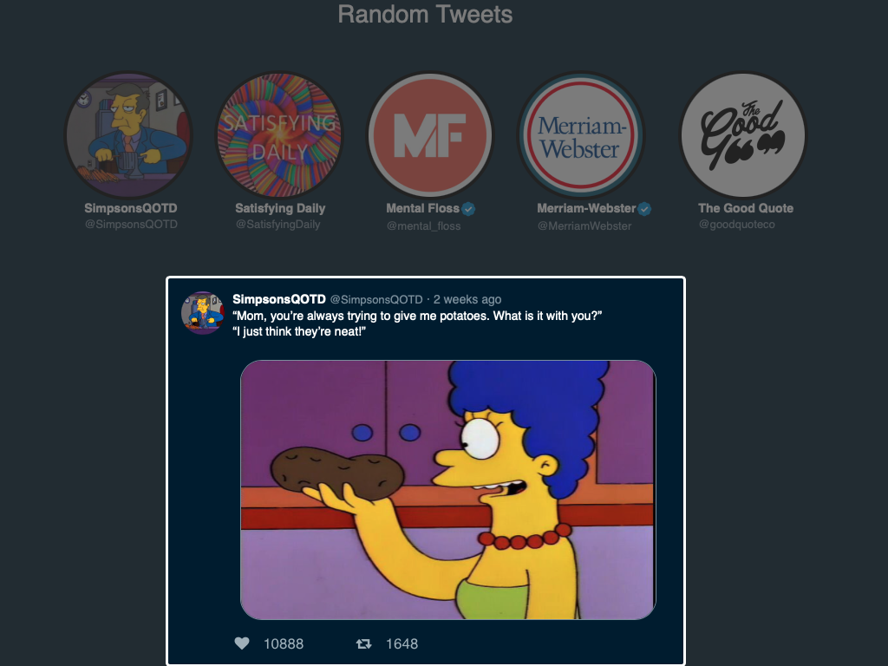

## Twitter Showcase App

A fun site to showcase tweets using JavaScript, React, .Net and C#.

Try it [here](https://twittershowcaseapp.azurewebsites.net)

#### Summary

This project was a whole new level of complexity for me.  It has a single page application for the front end with a back end service to communicate
with Twitter and serve up static files. Getting all these componets to communicate with each other was a challenge. I particularly enjoyed (eventually!)
learning ASP.Net Core to connect to Twitter's API and filter the data being served to the front end. Seeing live tweets coming through to my site, and not
my own mock data was a proud and joyfull moment for me in my programming journey.

#### Author

Greg Hilger - Full Stack Software Developer  [Website](gregoryhilger.com) | [LinkedIn](https://www.linkedin.com/in/gregoryhilger/)
